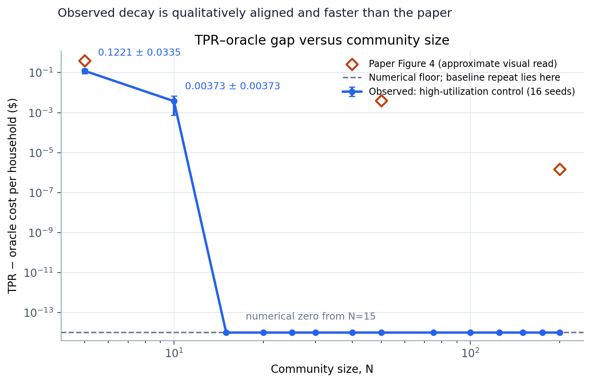
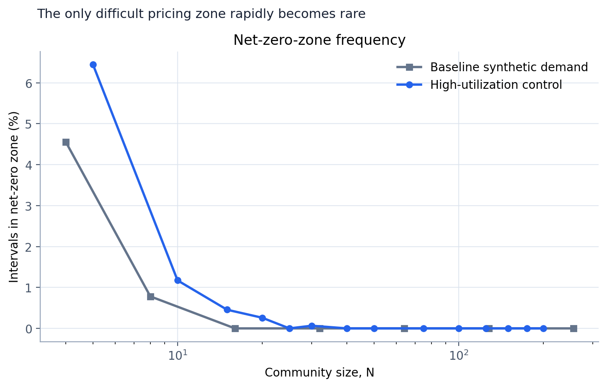
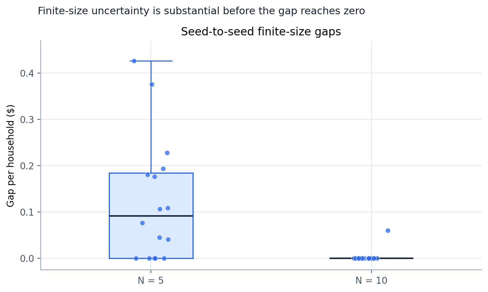
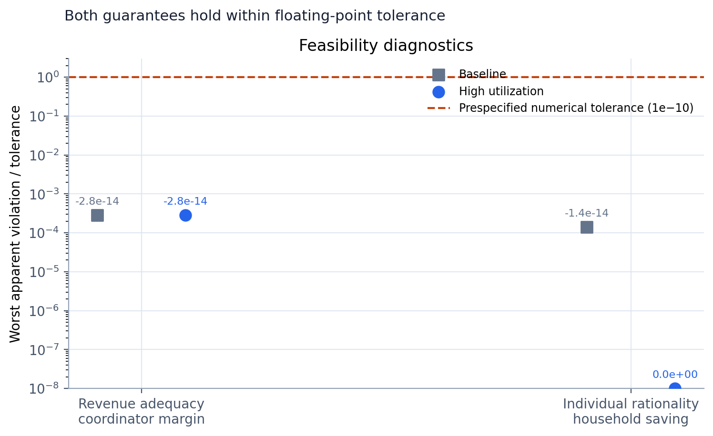

# When Does Simple Pricing Match a Perfect-Information Scheduler?



The central question in [arXiv:2607.15570](https://www.alphaxiv.org/abs/2607.15570) is whether a coordinator can schedule flexible household demand with a simple broadcast price while retaining the performance of a centralized scheduler. The paper's Figure 4 reports that the per-household cost gap between its Threshold Pricing Rule (TPR) and a perfect-information oracle decays approximately exponentially as the community grows.

**Assessment: partially aligned.** In the paper-faithful disclosed-parameter setup with synthetic EV demand, TPR and the oracle were already equal to numerical precision for every tested size. A deliberately harder high-utilization control produced a measurable gap of **$0.1221 ± $0.0335 per household at N=5**, **$0.00373 ± $0.00373 at N=10**, and numerical zero from **N=15** onward. The direction and rapid decay align with Figure 4, but the observed decay is faster and cannot establish the paper's quantitative rate because ACN demand preprocessing and plotted values were unavailable.

## The claim and the scheduling idea

Each household has renewable generation and deadline-constrained EV demand. The coordinator sees only aggregate conditions and broadcasts one of three price signals:

```text
aggregate renewable below mandatory charging  → import price π+ → charge only what deadlines require
aggregate renewable above charging capacity   → export price π− → charge as much as possible
aggregate renewable between the thresholds    → NEM price       → absorb renewable locally
```

The first two zones have closed-form actions. Only the middle, net-zero zone can separate the online TPR schedule from a scheduler that knows the future. As the number of independent households grows, aggregate uncertainty concentrates and this difficult zone should become less consequential.

The paper's empirical evidence contains three main groups of claims:

| Paper evidence | Reported result | Reproduction scope |
|---|---:|---|
| Figure 4, TPR vs oracle | TPR gap falls from roughly $0.4/household at the smallest plotted community to about $1.5×10⁻⁶ at N=200 (visual read); approximately exponential decay | Tested with disclosed parameters and synthetic EV-demand substitutions |
| Figure 4, LLF and MPC | Gaps plateau near $10⁻² and $10⁻¹, respectively, as N grows | Not attempted; policy details needed for a faithful implementation |
| Figure 5, individual savings | TPR improves savings over NEM-exp by 33.74%–67.58% with private solar and 0.38%–3.83% with shared solar | Not attempted; requires Pecan Street profiles, household shares, and preprocessing |

## What was implemented

The experiment uses a 24-hour horizon with 96 fifteen-minute intervals, a 7.2 kW charger, a six-hour maximum charging window, a truncated-Gaussian duration centered at five hours, i.i.d. lognormal renewable generation with mean 1.6 kWh, and NEM prices of $0.50/kWh for imports and $0.20/kWh for exports. These are the parameters disclosed around Figure 4.

For every seed and community size, one generated instance follows two code paths:

```text
seeded arrivals + EV jobs + renewables
                 │
        ┌────────┴────────┐
        │                 │
  online TPR schedule   sparse perfect-information LP
  three price zones     all jobs and renewables known
        │                 │
        └────────┬────────┘
                 │
      (TPR cost − oracle cost) / N
```

The oracle is a sparse linear program whose charging variables are bounded by charger capacity and whose equality constraints enforce every EV's energy demand and each interval's energy balance. The TPR path updates each job's mandatory minimum and feasible maximum charge, then chooses the paper's three-zone action. The experiment also runs each household under stand-alone NEM to check individual savings, and compares household payments with the utility bill to check coordinator revenue adequacy.

The published code is intentionally small: the formal implementation is on the [seeded synthetic scaling branch](https://github.com/S-Discipline/price-based-distributed-scheduling-of-flexible-d/tree/orx/seeded-synthetic-scaling-evaluation), full per-size telemetry is on the [telemetry repeat branch](https://github.com/S-Discipline/price-based-distributed-scheduling-of-flexible-d/tree/orx/baseline-full-telemetry-repeat), and the demand sensitivity is on the [high-utilization control branch](https://github.com/S-Discipline/price-based-distributed-scheduling-of-flexible-d/tree/orx/high-utilization-finite-gap-control).

## The difficult zone disappears quickly



In the baseline substitution, the net-zero zone occupied 4.56% of intervals at N=4, 0.78% at N=8, and none from N=16 onward. In the higher-utilization control, it fell from 6.45% at N=5 to 1.17% at N=10 and was effectively absent beyond the smallest communities. This diagnostic explains both the paper's expected convergence and why this reproduction hit the numerical floor earlier: the only zone capable of creating a visible online-versus-oracle separation became rare very quickly.

This is mechanism evidence, not an independent proof of the asymptotic theorem. The simulation horizon is finite, the household model is homogeneous, and the result depends on the synthetic demand distribution.

## Finite-size behavior varies across seeds



The high-utilization means do not describe every instance. At N=5, several seeds had exactly zero gap while the largest observed replicate reached $0.4258 per household; the mean was $0.1221 with a standard error of $0.0335. At N=10, fifteen of sixteen seeds were at numerical zero and one retained a visible gap, producing a mean and standard error both equal to $0.00373. This mixture of exact-zero and positive-gap instances is why the control supports rapid qualitative convergence but not a stable fitted exponential rate over many sizes.

## Revenue adequacy and individual rationality remain feasible



Across 336 total seeded instances, the worst coordinator margin was −$2.84×10⁻¹⁴ and the worst household saving relative to stand-alone NEM was −$1.42×10⁻¹⁴. Both are floating-point residuals more than three orders of magnitude inside the prespecified $10⁻¹⁰ numerical tolerance. Under these setups, the observed evidence is aligned with the paper's revenue-adequacy and individual-rationality guarantees.

These diagnostics check realized simulated trajectories. They do not replace the paper's analytical guarantees over the full model class.

## Claim-by-claim assessment

| Claim | Paper result | Observed result | Assessment | Compute |
|---|---|---|---|---:|
| Figure 4: TPR approaches the oracle as N grows | Approximately exponential; visually ≈$0.4 at the smallest N and ≈$1.5×10⁻⁶ at N=200 | Baseline: ≤$2.9×10⁻¹⁵ mean at every N. High-utilization control: $0.1221 at N=5, $0.00373 at N=10, numerical zero from N=15 | **Partially aligned** — same direction, faster floor; quantitative rate unresolved | 21 s formal + 11 s telemetry + 16 s control |
| Revenue adequacy | Coordinator payment balance is nonnegative | Minimum margin −$2.84×10⁻¹⁴ | **Aligned under this setup** — within $10⁻¹⁰ tolerance | Included above |
| Individual rationality | Every member is no worse off than under stand-alone NEM | Minimum saving −$1.42×10⁻¹⁴ baseline; $0 in control | **Aligned under this setup** — within tolerance | Included above |
| LLF and MPC gaps persist | LLF near $10⁻² and MPC near $10⁻¹ at large N | Not measured | **Not attempted** | — |
| Figure 5 savings ranges | 33.74%–67.58% private solar; 0.38%–3.83% shared solar | Not measured | **Not attempted** | — |

The three successful SSH runs consumed **48 seconds of remote wall time** in total. They executed on `root@ssh3.vast.ai:15694`, verified as a host with two RTX 3090 GPUs. The workload is CPU-bound sparse optimization, so GPU utilization is not a meaningful cost measure; forcing GPU work would not add evidence.

## Substitutions and limits

The decisive substitution is EV demand. The paper names ACN-Data but does not publish its preprocessing, random seeds, truncated-Gaussian standard deviation, or Figure 4 point values. The baseline therefore samples each job at 35%–85% of its feasible charging envelope; the sensitivity control uses 85%–100%. Both use 16 deterministic seeds per community size. The paper reference points in the headline chart are approximate visual reads and are deliberately shown as unconnected markers.

The reproduced TPR uses the disclosed threshold structure, but it is a compact independent implementation rather than the authors' code. A full-scale reproduction would still need:

- the exact ACN session filtering and conversion from sessions to EV energy/deadline pairs;
- the authors' random seeds and all Figure 4 community sizes or raw plotted values;
- faithful LLF and MPC definitions, including forecast construction and MPC horizon;
- Pecan Street solar preprocessing and shared-solar allocations for Figure 5;
- additional seeds around N=5–15, where the finite-size gap is a zero-inflated random variable.

## Reproduce or explore the evidence

The fixed formal command for every experiment node is:

```bash
python3 -m pip install --disable-pip-version-check -r requirements.txt && python3 reproduce.py
```

The self-contained [marimo tutorial](../../notebooks/tpr_figure4_tutorial.py) embeds the observed summary values and redraws the central evidence without rerunning the remote optimization. Because the repository is private, run it locally with:

```bash
uvx marimo edit notebooks/tpr_figure4_tutorial.py
uvx marimo run notebooks/tpr_figure4_tutorial.py
```

The exact plotted inputs are preserved in [`data/`](data/), and the four figures can be regenerated with `uv run --with matplotlib --with numpy python reports/tpr-figure4/make_figures.py`.
